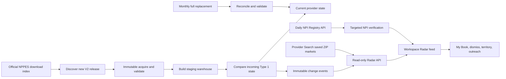

# New Provider Radar

> **Last reviewed: 2026-07-22** · **Status: cms-data backend foundation complete; Provider Search workflow remains pending**

**Owners:** `cms-data` owns public-source ingestion, change detection, provenance, and read-only APIs;
`provider-search` owns saved-market configuration, user state, notifications, and rep workflows.
**Initial grain:** Type 1 individual NPI at its primary NPPES practice location.

## Decision

Build New Provider Radar from three complementary NPPES surfaces:

| NPPES surface | Radar role |
| --- | --- |
| Weekly incremental V2 file | Primary discovery feed for new and changed NPI records |
| Monthly full replacement V2 file | Baseline and recurring reconciliation against missed or corrected changes |
| Daily-refreshed NPI Registry API | Targeted verification of an individual candidate, never bulk discovery |

There is no official daily bulk file. The Registry API does not expose an `updated_since` search,
returns at most 200 records per request and 1,200 records across supported pagination, and directs
bulk users to the downloadable dissemination files. Radar must not crawl ZIPs through that API.

Official references:

- [CMS NPPES Data Dissemination](https://www.cms.gov/medicare/regulations-guidance/administrative-simplification/data-dissemination)
- [NPPES Read API help](https://npiregistry.cms.hhs.gov/api-page)
- [Current NPPES downloadable files](https://download.cms.gov/nppes/NPI_Files.html)

## Product promise

> Show a rep newly relevant clinicians in a saved market, explain exactly why each clinician
> appeared, and make the clinician actionable without overstating what NPPES proves.

Radar is a source-backed change feed, not a claim that a clinician opened a new practice. The UI may
say "NPI issued," "practice ZIP changed," "taxonomy changed," or "NPI reactivated." It must not infer
"opened a practice," "joined this group," "is licensed," or "is accepting patients" from NPPES alone.

## Event vocabulary

The warehouse records source-level events. Provider Search translates those events into a market
explanation after matching the event's resulting ZIP against a saved market.

| Warehouse event | Source rule | Provider Search label | Release |
| --- | --- | --- | --- |
| `newly_enumerated` | Previously unseen active Type 1 NPI with an enumeration date inside the source period | New NPI | V1 |
| `practice_location_changed` | Existing NPI's primary practice ZIP changes | Entered market when the new ZIP is inside and old ZIP outside | V1 |
| `primary_taxonomy_changed` | Primary taxonomy differs from prior state | Specialty changed | V1.1 |
| `reactivated` | A new reactivation date appears or replaces a deactivated state | Reactivated | V1.1 |
| `deactivated` | A new deactivation date appears | Deactivated; excluded from the default feed | Later/operations |

Secondary practice locations require the bundled NPPES Practice Location Reference File. They are a
planned extension after the primary-location V1 foundation. Until then, the API contract and UI must
describe the primary practice location specifically.

## Product boundary

`cms-data` is the canonical public-data plane. It owns facts that are identical for every customer:

- immutable source release acquisition and validation;
- current NPPES provider, location, and taxonomy state;
- comparison with prior state and deterministic change events;
- monthly reconciliation and rollback-safe warehouse promotion;
- source freshness and evidence fields; and
- authenticated, read-only Radar APIs.

`provider-search` owns customer-specific configuration and workflow:

- workspace membership and authorization;
- saved ZIP markets and later assigned territories;
- taxonomy targeting rules and notification preferences;
- unread, reviewed, saved, and dismissed state;
- Add to My Book, campaigns, outreach, Planner, and My Territory actions; and
- email or in-app digests.

Provider facts must not be copied into Supabase merely to track user state. Provider Search should
store the stable `event_id` and workspace action state, then retrieve current public facts from this
API.

### Saved markets versus territories

Provider Search already stores named workspace markets as ZIP sets. V1 uses those saved markets as
the discovery boundary. A saved market does not assign an account, confer access, or imply exclusive
rep ownership. A future territory object may wrap the same geography with rep/team assignment and
effective dates without changing the Radar event model.

## End-to-end flow



Refresh jobs discover publisher metadata on a schedule but process only a changed publisher version.
They must never assume that a calendar date proves a release exists.

## Warehouse model

### `nppes_radar_provider_state`

One current Type 1 row per NPI. V1 retains:

- identity and credentials;
- enumeration, NPPES last-update, deactivation, and reactivation dates;
- primary taxonomy plus all 15 taxonomy positions;
- primary practice address, ZIP, and phone;
- a normalized record fingerprint;
- installed source release and source period; and
- first/last observed timestamps.

This table is serving state, not immutable history. Immutable change history lives in the event
ledger and source run artifacts.

### `nppes_radar_events`

One immutable row per detected source-level change. `event_id` is deterministic for a release,
provider, event type, effective date, and before/after ZIP and taxonomy values. The record stores the
old and new values required to explain why it matched a market.

Provider Search must use `event_id` as the durable foreign reference for read/dismissed/saved state.

### `nppes_radar_releases`

One row per applied monthly or weekly release. It records source ID, release kind, source period,
processing time, provider count, event count, and whether the release established the baseline.

The processor has these safety properties:

- the first installation must be an explicit monthly baseline;
- a baseline emits no historical "new" flood;
- applying the same source release again is a successful no-op;
- out-of-order source periods are rejected;
- validation and state/event writes run in one transaction; and
- failed processing leaves current state and the release ledger unchanged.

## Initial pipeline command

The current foundation accepts an extracted NPPES V2 main provider CSV. Run it only against a
staging candidate database, never the active production DuckDB file in place.

```bash
# Establish the first monthly baseline without emitting events.
.venv/bin/python -m pipeline.nppes_radar \
  --db data/staging/provider-search-candidate.duckdb \
  --csv data/runs/nppes_monthly_v2/<run-id>/npidata_pfile.csv \
  --release-id NPPES_Data_Dissemination_July_2026_V2 \
  --kind monthly_full \
  --period-start 2026-07-13 \
  --period-end 2026-07-13 \
  --baseline

# Apply the next weekly incremental.
.venv/bin/python -m pipeline.nppes_radar \
  --db data/staging/provider-search-candidate.duckdb \
  --csv data/runs/nppes_weekly_incremental_v2/<run-id>/npidata_pfile.csv \
  --release-id NPPES_Data_Dissemination_071326_071926_Weekly_V2 \
  --kind weekly_incremental \
  --period-start 2026-07-13 \
  --period-end 2026-07-19
```

Discovery already recognizes official monthly and weekly V2 filename shapes. Download, archive
validation, extraction, secondary-location ingestion, and integration with versioned warehouse
promotion remain follow-up pipeline work.

## Read API contract

`GET /radar/providers` returns source events whose resulting primary ZIP matches the supplied ZIP
set. It is intentionally market-agnostic: Provider Search resolves and authorizes the workspace
market, then passes its ZIPs to this service.

Example:

```http
GET /radar/providers
  ?zip5=80206
  &zip5=80220
  &event_type=newly_enumerated
  &event_type=practice_location_changed
  &taxonomy_code=207RC0000X
  &since=2026-07-01
  &until=2026-07-31
```

The response includes:

- total, offset, limit, and the latest installed NPPES source period;
- event identity, type, effective date, and source release;
- current provider identity, taxonomies, and primary practice location;
- old/new ZIP or taxonomy evidence; and
- a deterministic human-readable reason.

The endpoint defaults to the V1 event types and the last 30 days, excludes currently deactivated
providers, accepts 1-100 ZIPs, and is protected by the existing API-key dependency in `api/main.py`.

### Provider Search persistence contract

The application should add customer-scoped tables similar to:

```text
workspace_market_radar_rules
  workspace_id
  market_id
  included_taxonomy_codes
  included_event_types
  notifications_enabled

workspace_radar_item_states
  workspace_id
  market_id
  event_id
  status                 unread | reviewed | saved | dismissed
  dismissal_reason
  acted_by_user_id
  acted_at
```

Every read/write must resolve an active workspace membership. Company-level assignments should wait
for the explicit team/territory model rather than overloading a saved market.

## V1 experience

1. A rep selects an existing saved market or creates a ZIP market.
2. The rep selects target provider taxonomies and enables Radar.
3. Radar shows `New NPI` and `Entered market` candidates from installed weekly events.
4. Every card states the exact source reason and source period.
5. Already-known NPIs are labeled or excluded using My Book state.
6. The rep can Add to My Book, view the provider, show the location in My Territory, or dismiss.
7. A weekly digest links into the persistent feed; email is not the source of truth.
8. Opening or acting on a candidate may trigger a targeted Registry API verification.

Example evidence copy:

> **Dr. Jane Smith — Interventional Cardiology**
> New NPI issued July 8, 2026
> Primary practice location: 123 Main St, Denver, CO 80206
> NPPES source week ending July 12 · verified July 14

An address-change candidate must say that the NPI is older:

> **Dr. Robert Jones — Gastroenterology**
> Primary practice ZIP changed from 80014 to 80220
> NPI originally issued in 2011; this is an address change, not a new NPI.

## Ranking and enrichment

V1 should rank deterministic evidence, not opaque AI output:

1. target taxonomy match;
2. event freshness;
3. newly enumerated before address-only changes;
4. primary-location evidence before future secondary-location evidence; and
5. not already present in My Book.

Medicare utilization is useful context when available but cannot be required. A genuinely new NPI
will often have no claims history for years. Google/place matching and web enrichment should be
selective follow-up work after a candidate matches a market, not a national batch prerequisite.

## Quality and trust rules

- Never equate NPI issuance with licensure, credentialing, employment, or a new office opening.
- Always show event type, effective date, source period, and current verification time when present.
- Keep `enumeration_date`, `source_last_updated_date`, ingestion time, and observation time distinct.
- Suppress deactivated records from the default discovery feed.
- Do not classify an address edit within the same ZIP as entering a ZIP-based market.
- Do not create duplicate user items when monthly reconciliation confirms a weekly event.
- Preserve leading zeros in NPI-adjacent ZIP fields by storing them as text.
- Keep NPI as the provider identity key; location changes do not create a new provider.

## Verification and acceptance criteria

### Pipeline

- A small monthly fixture establishes state and emits zero events.
- A weekly fixture emits a new-enumeration event only when enumeration falls within its period.
- A ZIP change emits one location-change event with old and new ZIP values.
- A taxonomy change and reactivation are distinct events.
- Reapplying a release produces no new state or events.
- Applying a weekly file without a baseline or applying an older source period fails safely.
- A malformed V2 schema, invalid NPI, or duplicate NPI fails the entire transaction.

### API

- Only requested ZIPs and event types are returned.
- Taxonomy filters inspect all retained taxonomy codes.
- Deactivated providers are excluded by default.
- Pagination is deterministic and bounded.
- Missing Radar tables return a service-unavailable response rather than fabricated empty data.
- Source freshness comes from `nppes_radar_releases`, not database file modification time.

### Product

- The feed never floods existing providers when a baseline is installed.
- The UI distinguishes a new NPI from an existing provider moving into the market.
- Add to My Book and dismissal state are workspace-scoped and idempotent.
- A user cannot query or mutate another workspace's Radar state.
- A monthly reconciliation does not duplicate a previously observed weekly event.

## Delivery sequence

### Phase 0 — precision spike

Run historical weekly releases against one or two real saved ZIP markets. Measure candidate volume,
taxonomy fit, duplicate rate, missing locations, and obvious false positives before enabling email.

### Phase 1 — backend V1

- Monthly baseline and weekly Type 1 main-file processing
- Current primary-location/taxonomy state
- New enumeration and primary ZIP-change events
- Read-only ZIP/taxonomy API
- Source-period and idempotency tests

### Phase 1.1 — complete NPPES location semantics

- Immutable NPPES ZIP acquisition integrated with manifests
- Practice Location Reference File for secondary locations
- Monthly reconciliation validation and promotion automation
- Primary taxonomy changes and reactivation surfaced to the product
- Targeted Registry API verification cache

### Phase 2 — Provider Search workflow

- Radar setup from saved workspace markets
- Persistent list/map feed and reason chips
- My Book, My Territory, campaign, and dismissal actions
- Weekly digest after precision is acceptable
- Funnel and dismissal-reason telemetry

### Phase 3 — organization and team intelligence

- Type 2 organization events
- Explicit team territory assignments
- Manager rollups and assignment workflows
- Departures, moves out, and competitive movement signals

## Success metrics

The north-star measure is the percentage of reviewed Radar providers that are added to My Book and
receive a logged outreach action within 14 days.

Supporting measures:

- relevant candidates per active market per week;
- feed review and Add to My Book rates;
- time from source publication to first rep action;
- dismissal rate and reason distribution;
- percentage already known to the rep;
- duplicate-event rate; and
- percentage materially changed by targeted daily verification.

Do not set numeric targets until the Phase 0 market sample establishes a credible denominator.

## Explicit non-goals for the first release

- daily nationwide crawling of the NPI Registry API;
- proof that a practice opened or a provider joined a specific organization;
- Type 2 organization monitoring;
- polygon or radius territories;
- team account assignment and manager administration;
- automatic nationwide Google/place enrichment;
- AI-generated lead explanations; and
- writes or refreshes from API request handlers.
