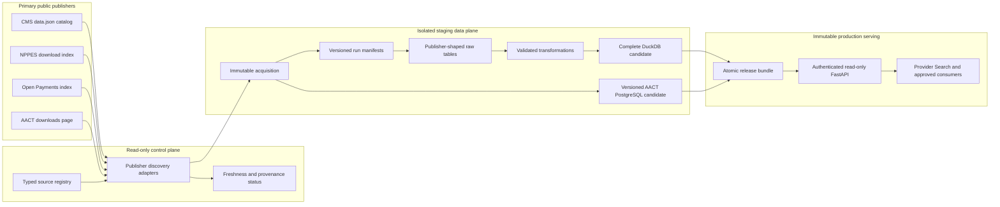
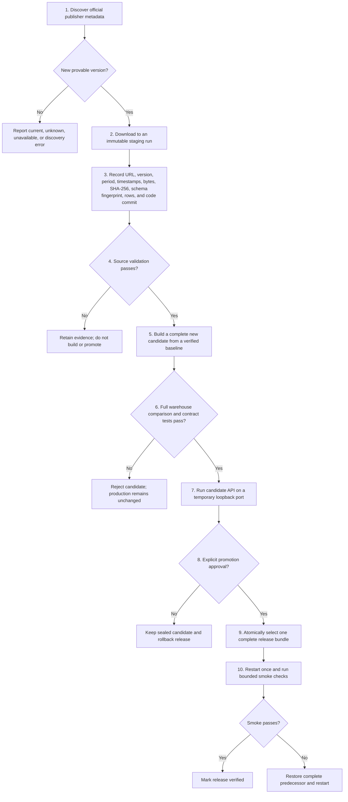
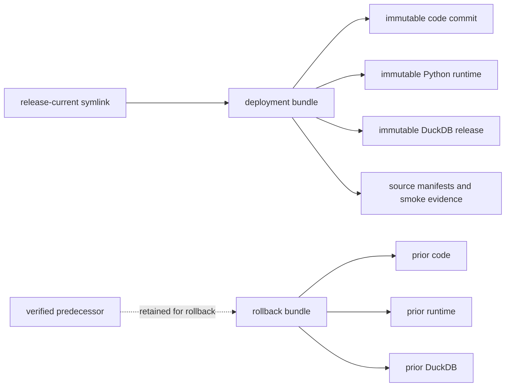

# Provider Intelligence Data Platform

> **Last reviewed: 2026-07-22** · **Status: current production overview**

> A production-grade public healthcare data foundation that turns fragmented federal datasets into
> trustworthy provider, practice, market, industry, and research intelligence.

The Provider Intelligence Data Platform is the canonical public-data plane for Provider Search. It
discovers and validates primary publisher releases, preserves immutable source provenance, builds
complete analytical releases, and serves stable read-only API contracts to downstream products.

The platform registers 18 sources from CMS, NPPES, Open Payments, and AACT / ClinicalTrials.gov.
The active production release contains the previously validated 16-source bundle; the two PPEF
relationship subfiles are registered for staged acquisition and are not production data until a
complete candidate passes comparison and promotion. Each release is reproducible,
checksum-verified, tested against the prior warehouse, and promoted as one atomic bundle with a
complete rollback release retained.

**Validated production release snapshot - July 22, 2026**

| Platform signal | Validated scale |
| --- | ---: |
| Registered publisher sources | 18 |
| Sources in active validated production bundle | 16 |
| Public publishers and official indexes | 4 |
| Core provider records | 7,373,208 |
| Practice locations | 2,341,984 |
| Provider-service records | 9,306,818 |
| Provider-drug records | 22,444,680 |
| Open Payments general-payment records | 16,131,856 |
| Inferred hospital affiliations | 139,775 |
| AACT clinical studies | 594,772 |

These figures describe the active validated release. Every future production change still requires
an explicit promotion decision and a successful post-restart smoke test.

## What the platform makes possible

- **Provider discovery:** normalize identity, specialty, taxonomy, enrollment, and location data
  around NPI.
- **Practice intelligence:** resolve provider rosters, group practices, primary sites, and market
  footprints.
- **Utilization intelligence:** compare Medicare volume, payments, beneficiary mix, prescribing,
  DME referral activity, and service patterns.
- **Network intelligence:** identify conservatively inferred provider-hospital relationships with
  explicit source and confidence labels.
- **Industry transparency:** summarize reported general payments and expose research and ownership
  records without implying endorsement, causation, or misconduct.
- **Research intelligence:** connect investigators and providers to the daily AACT mirror of
  ClinicalTrials.gov.
- **Market change detection:** detect new providers, moves, taxonomy changes, reactivations, and
  deactivations through the NPPES Radar event model.

## Curated data marts

The platform preserves publisher-shaped raw tables for auditability and builds opinionated marts for
product use. NPI remains the shared provider identity key. The source column identifies each mart's
primary direct inputs; shared NPPES identity and location enrichment can also support joins across
multiple marts.

| Data mart | Primary source(s) | Primary tables | Product-ready questions |
| --- | --- | --- | --- |
| Provider identity and directory | NPPES Monthly V2; NPPES Weekly Incremental V2; Physician & Other Practitioners - by Provider; PECOS Public Provider Enrollment | `core_providers`, `raw_nppes` | Who is this provider, what is their specialty or taxonomy, and where are they located? |
| Practices and provider rosters | Revalidation Clinic Group Practice Reassignment; NPPES Monthly V2 and Weekly Incremental V2 | `practice_locations` | Which clinicians appear in a group, and what is the practice's geographic footprint? |
| Medicare utilization | Physician & Other Practitioners - by Provider; Part D - by Provider; DMEPOS - by Referring Provider | `utilization_metrics` | What is the provider's service volume, beneficiary mix, Medicare payment profile, prescribing profile, and DME referral activity? |
| Services and drugs | Physician & Other Practitioners - by Provider and Service; Part D - by Provider and Drug | `provider_service_detail`, `provider_drug_detail` | Which services and medications characterize the provider's activity? |
| Hospital network intelligence | Revalidation Clinic Group Practice Reassignment; Hospital Enrollments | `hospital_affiliations`, `raw_hospital_enrollments` | Which hospital relationships can be conservatively inferred, and with what evidence and confidence? |
| Enrollment, billing reassignment, and eligibility | PECOS Public Provider Enrollment and its Reassignment and Practice Location subfiles; Order and Referring | `raw_pecos_enrollment`, `raw_pecos_reassignment`, `raw_pecos_practice_location`, `order_referring_eligibility` | Is a provider enrolled, which entities receive reassigned Medicare benefits, where are those enrollment entities located, and what can the provider order or refer? |
| Quality and participation | Quality Payment Program Experience | `provider_quality_scores` | What public QPP participation, practice, and quality measures are available? |
| Industry and research relationships | Open Payments General; Open Payments Research; Open Payments Ownership | `industry_relationships`, `kol_summary`, Open Payments raw tables | Which reported transfers of value, research payments, and ownership records are associated with a provider? |
| New Provider Radar | NPPES Monthly V2; NPPES Weekly Incremental V2 | `nppes_radar_provider_state`, `nppes_radar_events`, `nppes_radar_releases` | What changed in the provider market, when did it change, and which publisher release proved it? |
| Clinical research | AACT ClinicalTrials.gov snapshot | AACT PostgreSQL `ctgov` schema | Which studies, investigators, sponsors, conditions, interventions, and facilities are represented in ClinicalTrials.gov? |

## Source portfolio and update cadence

Schedules are discovery opportunities, not permission to ingest. A source advances only when its
official publisher metadata exposes a different, parseable release and every validation gate passes.

| Source | Publisher cadence | Platform policy | Source-period meaning | Latest validated candidate period |
| --- | --- | --- | --- | --- |
| Physician and Other Practitioners - by Provider | Annual | Check daily; promote new release within 48 hours | Calendar-year Medicare FFS utilization | 2024 |
| Physician and Other Practitioners - by Provider and Service | Annual | Check daily; promote new release within 48 hours | Calendar-year utilization by NPI, HCPCS, and place of service | 2024 |
| Part D Prescribers - by Provider | Annual | Check daily; promote new release within 48 hours | Calendar-year Part D summary | 2024 |
| Part D Prescribers - by Provider and Drug | Annual | Check daily; promote new release within 48 hours | Calendar-year drug utilization | 2024 |
| DMEPOS - by Referring Provider | Annual | Check daily; promote new release within 48 hours | Calendar-year DME referral utilization | 2023 |
| Quality Payment Program Experience | Annual | Check daily; promote new release within 48 hours | QPP performance year | 2024 |
| PECOS Public Provider Enrollment | Quarterly | Check weekly; promote within 72 hours | Quarter-end enrollment snapshot | Q1 2026 |
| PECOS Reassignment subfile | Quarterly | Check weekly; promote only with a same-period PPEF enrollment bundle | Enrollment ID reassigning benefits × enrollment ID receiving benefits | Not yet promoted |
| PECOS Practice Location subfile | Quarterly | Check weekly; promote only with a same-period PPEF enrollment bundle | Enrollment ID × city × state × ZIP | Not yet promoted |
| Order and Referring | About twice weekly | Check daily; promote changed version within 48 hours | Publisher eligibility interval | Jul 12-18, 2026 |
| Hospital Enrollments | Monthly | Check daily; promote changed version within 48 hours | Month-end hospital enrollment snapshot | May 2026 |
| Revalidation Clinic Group Practice Reassignment | Monthly | Check daily; promote changed version within 48 hours | Month-end reassignment snapshot | Jul 2026 |
| NPPES Monthly V2 | Monthly full snapshot | Reconcile every monthly release | Authoritative full NPPES V2 snapshot | Jul 13, 2026 |
| NPPES Weekly Incremental V2 | Weekly incremental | Apply in publisher-period order | Inclusive filename start and end dates | Jul 13-19, 2026 |
| Open Payments General | Annual plus January correction | Check weekly; daily in June/July and January windows | Program-year reported transactions | 2025 |
| Open Payments Research | Annual plus January correction | Check weekly; daily in release windows | Program-year research payments | 2025 |
| Open Payments Ownership | Annual plus January correction | Check weekly; daily in release windows | Program-year ownership interests | 2025 |
| AACT ClinicalTrials.gov snapshot | Daily | Stage after each available upstream snapshot | AACT export date, distinct from study update dates | Jul 21, 2026 |

### NPPES operating cadence

NPPES uses three deliberately different loops:

1. **Weekly change detection:** apply each incremental file in publisher-period order and emit
   idempotent Radar events.
2. **Monthly authoritative reconciliation:** replace the baseline from every full V2 snapshot,
   reconcile all NPIs, and validate prior weekly state. Weekly files never substitute for this full
   refresh.
3. **Daily targeted verification:** use the NPPES Registry API only for already-selected NPIs and
   confidence labeling. It is not a bulk source and cannot advance the installed release.

An unexplained gap or overlap blocks the weekly chain until resolved or until the next full monthly
snapshot establishes a new baseline.

## System architecture



### Clear ownership boundaries

| Component | Owns | Does not own |
| --- | --- | --- |
| `cms-data` | Public-source discovery, bulk acquisition, validation, DuckDB and AACT releases, promotion, rollback, read-only data API | Product UI, customer workflow state, private claims, PHI |
| `provider-search` | Product behavior, access plans, UI, workflows, and upstream contract checks | Bulk public-data ingestion or canonical warehouse construction |
| `cms-public-data-catalog` | Metadata reference | Runtime ingestion or production data |
| `healthcare-ai` | Separate experimental/private-data work | Canonical public-data warehouse |

## End-to-end release flow



### The five release gates

1. **Version gate:** a primary publisher exposes a parseable release that differs from the installed
   manifest. Unknown or unavailable metadata never authorizes acquisition.
2. **Acquisition gate:** the source artifact and its provenance are immutable and checksum-verified.
3. **Validation gate:** schema, source period, identifiers, uniqueness, row bounds, and
   source-specific invariants pass.
4. **Comparison gate:** the complete candidate is compared with the immutable baseline; only
   intended tables may change and Provider Search contracts must pass.
5. **Promotion gate:** code, runtime, DuckDB, AACT snapshot, and manifest evidence are sealed; a
   verified predecessor remains available; and smoke plus rollback are ready.

## Production release and rollback model

The active DuckDB file is never modified or overwritten. Production selects one immutable bundle,
and that bundle points to exact code, runtime, and database artifacts.



AACT is PostgreSQL-backed and therefore cannot share a filesystem-atomic transaction with the
DuckDB bundle pointer. A combined cutover uses an API-stopped coherence boundary: systemd refuses
startup while an AACT transition sentinel exists, the prior AACT database is retained under a
versioned rollback name, both selectors are verified before startup, and a failed smoke test restores
both data systems before the API returns.

## Read-only API surface

The secured FastAPI service opens DuckDB read-only and exposes purpose-built contracts rather than
requiring downstream products to understand publisher schemas.

| Contract family | Representative capabilities |
| --- | --- |
| Provider profiles and search | Provider identity, specialty, taxonomy, public enrollment, utilization, and enriched profile data |
| Practice intelligence | Specialty capabilities, practice search, provider rosters, site profiles, and market snapshots |
| Industry relationships | Open Payments search, normalized options, company summaries, and provider detail |
| Research evidence | Investigator matching and research-payment evidence |
| Clinical trials | AACT version identity and study search |
| New Provider Radar | Provider-market change events with source release and effective date |
| Explorer and matching | Curated catalog, bounded samples, unified search, and entity matching |

Every production smoke test proves process code, runtime, and database identity; health and
authentication; Provider Search practice and profile contracts; Open Payments; research and clinical
trials; required tables; and exact expected row counts. Smoke evidence is deployment-specific and
time-bounded so an earlier deployment's result cannot be reused.

## Trust, provenance, and safety

- **Primary publishers only:** discovery uses the CMS `data.json` catalog, official NPPES index,
  official Open Payments index, and official AACT downloads page. Dated archive URLs are never
  guessed or hard-coded.
- **Unknown stays unknown:** file modification time is not publisher provenance. Missing installed
  evidence cannot be promoted to "current" by inference.
- **Immutable lineage:** each run records source ID, publisher version, source period, publisher
  release time, discovery and retrieval time, source URL, bytes, SHA-256, schema fingerprint, row
  counts, code commit, validation state, and promotion state.
- **No production writes from the API:** refresh work happens in staging; the serving process is
  read-only.
- **No PHI:** this public-data plane must not receive private customer claims, PHI, or uploaded
  client datasets.
- **Conservative interpretation:** hospital affiliations are inferred only when the normalized
  hospital name and state identify one hospital NPI. Ambiguous matches are excluded and confidence
  is exposed downstream.

## Data-use and attribution guardrails

- Attribute CMS and NPPES and do not imply government endorsement. An NPI is an identifier, not
  validation of licensure or credentials.
- Describe Open Payments as reported transfers of value. Do not imply endorsement, causation, or
  misconduct.
- Attribute ClinicalTrials.gov and AACT, show the processing date, disclose modifications, and do
  not use registry email addresses for marketing.
- HCPCS Level I content includes AMA CPT codes and descriptions. Commercial exposure remains blocked
  until an appropriate AMA license or approved filter is confirmed.

## Official publisher metadata

- [CMS data catalog](https://data.cms.gov/data.json)
- [NPPES downloadable files](https://download.cms.gov/nppes/NPI_Files.html)
- [Open Payments datasets](https://openpaymentsdata.cms.gov/datasets)
- [AACT downloads](https://aact.ctti-clinicaltrials.org/downloads)

## Operational references

- [Provider Data Platform Operating Model](data-platform-operating-model.md)
- [Production Cutover Runbook](production-promotion-runbook.md)
- [AACT / ClinicalTrials.gov Operations](aact-clinical-trials.md)
- [New Provider Radar](new-provider-radar.md)
- [Repository README](../README.md)
- [Styled PDF edition](../output/pdf/cms-data-platform-overview.pdf)

Rebuild the PDF from the repository root with a Python environment that has `reportlab` installed.
The Codex Desktop bundled workspace runtime includes it; a standalone local environment can install
it without changing the API dependency set:

```bash
uv pip install --python .venv/bin/python reportlab
.venv/bin/python scripts/build_platform_overview_pdf.py
```

---

*Snapshot metrics and source periods reflect the active validated July 22, 2026 production release.
This document is an architectural and operating overview, not a production runbook.*
